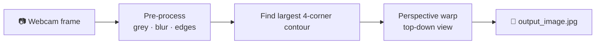

<div align="center">

# 📄 Paper Scanner

**Turn your webcam into a document scanner: detect a sheet of paper, straighten it and save a clean scan.**


</div>

---

## ✨ How it works



1. Each frame is converted to a thresholded edge image.
2. The **largest four-point contour** (the paper) is found and its corners are ordered.
3. A **perspective transform** flattens it to a 640 × 480 top-down view.
4. The result is shown live and saved as `output_image.jpg`. Press **Q** to quit.

## 🚀 Getting Started

```bash
git clone https://github.com/Arashomranpour/paper_scanner.git
cd paper_scanner
pip install opencv-python numpy
python app.py
```

> 📷 `app.py` opens camera index `1` (`cv2.VideoCapture(1)`); change it to `0` if you only have one camera.
> A PyInstaller build (`build/` and `dist/`) is included in the repository for Windows.

## 📁 Project Structure

```
.
├── app.py         # Scanner: contour detection + perspective warp
├── app.spec       # PyInstaller spec
├── build/  dist/  # Packaged Windows application
```

## 🛠️ Tech Stack

`OpenCV` · `NumPy` · `PyInstaller`
